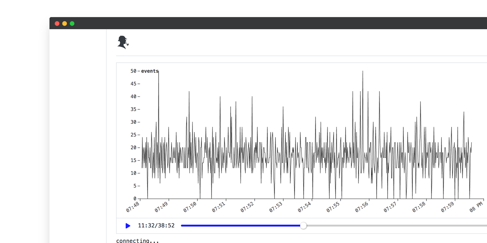

<p align="center">
    <a href="https://travis-ci.com/sherl0g/prisma">
        
    </a>
    <a href="https://github.com/sherl0g/prisma/blob/main/LICENSE">
        
    </a>
</p>

# Sherlog Prisma
An intuitive observability client for [@sherlog/cli](https://github.com/sherl0g/cli). Replay and drill down through multiple log types as data is piped in
<p align="center">
  <br>
  
  <br>
  <br>
</p>

Demo: <a href="https://sherlog.sh" target="_blank">https://sherlog.sh</a>

## Project setup

```
yarn install
```

### Compiles and hot-reloads for development

```
yarn serve
```

### Compiles and minifies for production

```
yarn build
```

### Run your unit tests

```
yarn test:unit
```

### Run your end-to-end tests

```
yarn test:e2e
```

### Lints and fixes files

```
yarn lint
```

### Customize configuration

See [Configuration Reference](https://cli.vuejs.org/config/).
